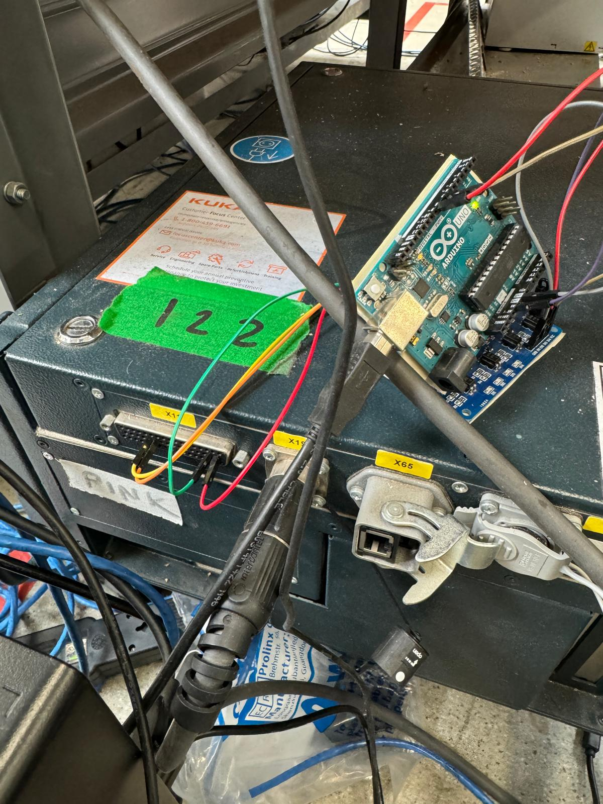

# Hand Guiding Configuration and Data Collection for [Robot Model/Project Name]

This repository contains scripts and instructions for configuring and utilizing hand guiding on the robot. Follow the steps below to set up the system and ensure smooth operation.

---

## Step 1: Configure ESM States

1. **Configure ESM 1**:
   - Set up the **Hand Guiding Device inactive** AMF with a **Stop 1 Reaction**.
   - Enable only the **first enabling switch** and use the input `CIB_SR.5` in Safety Configuration.
   - This corresponds to **pins 18/19** and **28/29** on x11 port (other pins can also be used as needed).

2. **Configure ESM 2**:
   - This state can be configured with any valid setting. 
   - Example: Set up **Cartesian Velocity Monitoring** at `x mm/s`.

---

## Step 2: Replace the Medien Flensch

- Set up a **two-channel switch** to complete the circuit between the pins mentioned in Step 1.
- Alternatively, use two separate switches and press both simultaneously to activate hand guiding.

### Recommended Setup:
- Use a **microcontroller** and a **relay**.
- Control the circuit using a Python script that provides high or low signals to activate or deactivate hand guiding.

---

## Notes for Smooth Operation

- Ensure the robot is in **Auto Mode** for hand guiding to function correctly.
- **Data Collection Script**:
  - The script in this repository is designed for data collection.
  - Data is stored in the controller at `krc/roboter/datacollection`.
- **ROS2 Connection Limitation**:
  - Hand guiding and ROS2 connection cannot operate simultaneously.

---

## Repository Contents

- **Python Script**: Automates circuit activation for hand guiding.
- **Configuration Guide**: Step-by-step instructions for ESM and circuit setup.

---

## Prerequisites

- **Hardware**:
  - Microcontroller
  - Relay for switch setup.
  - Jumper cables
- **Software**:
  - Python environment for running the relay script.
  - Sunrise for setting up hand guiding

---
